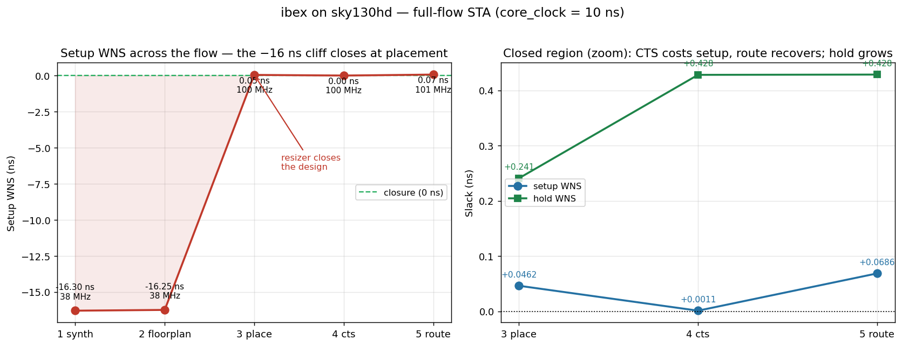

# vlsi-independence

My public build log for going deep in open-source EDA, timing/synthesis, and AI-for-EDA — with the goal of independence.

**Blog:** [vamshireguri.github.io/vlsi-independence](https://vamshireguri.github.io/vlsi-independence/)
· Post #1: [Week 1: open-source STA vs. what I do at work](https://vamshireguri.github.io/vlsi-independence/2026/08/15/week1-open-source-sta-vs-what-i-do-at-work.html)

## Goal (12 months)
- Leverage my synthesis / STA / timing-closure background into open-source EDA + AI-for-EDA.
- Sequenced plan: **software-first** (SDC/timing tooling) → **GNN timing models** → **RTL→GDS + silicon (Tiny Tapeout)**.
- Month 9–12: become hireable at an AI-EDA / ML-systems / verification-AI startup as a springboard toward independent work.

## About me
R&D engineer with hands-on experience in logic synthesis, static timing analysis (STA), timing constraints (SDC), and standard-cell characterization.

## Week 1 — results

Two designs taken RTL→GDS on **sky130hd** with OpenROAD Flow Scripts, then re-timed
independently with OpenSTA. Full narrative in [`notes/week1.md`](notes/week1.md).

**ibex** (`core_clock` = 10 ns) — STA on every flow stage, one SDC per stage:

| Stage | Clock | Parasitics | Setup WNS | Hold WNS | f_max |
|---|---|---|---:|---:|---:|
| synth | ideal | none | −16.3004 | +0.2265 | 38.02 MHz |
| floorplan | ideal | none | −16.2477 | +0.2265 | 38.10 MHz |
| place | ideal | estimated | **+0.0462** | +0.2409 | 100.46 MHz |
| cts | propagated | estimated | +0.0011 | +0.4280 | 100.01 MHz |
| route | propagated | real SPEF | **+0.0686** | +0.4284 | 100.74 MHz |



Timing closure is a **back-end** event: the placement resizer absorbs the whole −16 ns,
so synth-stage slack is not a usable signal in this flow
([`notes/day6-full-flow-timing.md`](notes/day6-full-flow-timing.md),
[`notes/day4-synth-vs-postplace.md`](notes/day4-synth-vs-postplace.md)).

**gcd** (`core_clock` = 1.1 ns, ORFS's aggressive default): WNS −1.49 ns, TNS −66.8 ns over
64 setup endpoints, 0 hold violations, min achievable period 2.58 ns. Waiving the single
worst path with `set_false_path` bought **5 ps** — the violations are one cluster of
sibling datapath paths.

**PDK:** reproduced the `sky130_fd_sc_hd__inv_2` `A→Y` NLDM delay by hand (bilinear
interpolation on slew × load) and matched OpenSTA to **< 0.01 ps**
([`pdk-experiments/`](pdk-experiments/)).

## Progress log

| Day | Topic | Artifacts |
|---|---|---|
| 1 | Open-source EDA landscape + gap analysis; ORFS bring-up; gcd RTL→GDS | [`notes/week1.md`](notes/week1.md) |
| 2 | Standalone OpenSTA on gcd + Python timing-report parser | [`sta-experiments/`](sta-experiments/) |
| 3 | SDC exceptions (`set_false_path`, `set_multicycle_path`) and measured ΔWNS | [`sta-experiments/gcd/`](sta-experiments/gcd/) |
| 4 | Standalone Yosys synthesis of ibex; synth vs. post-place timing | [`notes/day4-synth-vs-postplace.md`](notes/day4-synth-vs-postplace.md) |
| 5 | `.lib` / `.lef` anatomy; NLDM arc-delay reproduction | [`pdk-experiments/README.md`](pdk-experiments/README.md) |
| 6 | Full-flow STA across all five ORFS stages + chart | [`notes/day6-full-flow-timing.md`](notes/day6-full-flow-timing.md) |
| 7 | Publish: blog post #1, repo cleanup, Week 2 plan | [`docs/`](docs/), [`notes/week2-plan.md`](notes/week2-plan.md) |

## Structure

| Path | Contents |
|---|---|
| [`notes/`](notes/) | Weekly notes, per-day findings, next-week plan |
| [`docs/`](docs/) | The blog (Jekyll site served by GitHub Pages) |
| [`sta-experiments/`](sta-experiments/) | OpenSTA runs, SDC variants, report parser, notebooks |
| [`synth-experiments/`](synth-experiments/) | Yosys synthesis of ibex + staged/full-flow STA |
| [`pdk-experiments/`](pdk-experiments/) | sky130hd `.lib` / `.lef` inspection and delay-model check |

## Reproducing

All flows run inside `openroad/orfs:latest` against an ORFS checkout at
`~/OpenROAD-flow-scripts` with the `gcd` and `ibex` sky130hd flows already run.

```bash
# gcd: standalone OpenSTA + parsed WNS/TNS
cd sta-experiments/gcd && ./run_sta.sh
python ../parse_timing_report.py reports/report_checks.rpt

# ibex: Yosys synthesis + staged STA (Day 4)
bash synth-experiments/ibex/scripts/run_day4.sh

# ibex: STA on every ORFS stage (Day 6)
bash synth-experiments/ibex/scripts/run_day6.sh

# sky130hd cell: liberty/LEF slices + NLDM arc-delay check (Day 5)
bash pdk-experiments/run_pdk.sh
```

Python deps for the notebooks and parser: [`sta-experiments/requirements.txt`](sta-experiments/requirements.txt).

Heavy build output (GDS/DEF/ODB, PDKs, full logs) is deliberately **not** committed — see
[`.gitignore`](.gitignore). Every committed report is small and cited by a note.

## License

[MIT](LICENSE). Personal project built on my own time and hardware with public tools,
public PDKs, and public designs.
